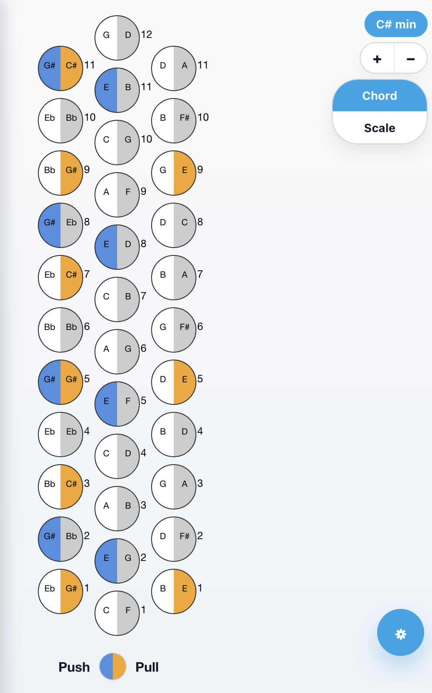

# Accordion Keyboard Visualizer

[](https://shogunweb.github.io/Accordion-keyboard-map/)
[](./docs/user/getting-started.md)


A web application that visualizes the right-hand button layout of a diatonic or unisonoric accordion.

It allows the user to:

- Display different accordion keyboard layouts (rows, offsets, push/pull notes)
- Compute and visualize **chords** and **scales** using Tonal.js
- Highlight the corresponding notes directly on the keyboard
- Switch layouts dynamically
- Use the app as a PWA (optional)



---

## Technologies

- **React + TypeScript**
- **Vite** (build + dev server)
- **Tailwind CSS 4** (via `@tailwindcss/postcss`)
- **Tonal.js** for music theory
- Pure **SVG** for rendering the accordion buttons

---

## 📁 Project Structure

```
Accordeon-keyboard/
├─ public/
│  └─ index.html           # HTML entry point
├─ src/
│  ├─ main.tsx             # App entry point
│  ├─ App.tsx              # UI + tonal.js logic
│  ├─ styles.css           # Tailwind CSS entry
│  ├─ components/
│  │  └─ AccordionKeyboard.tsx   # Renders the keyboard
│  └─ data/
│     └─ keyboards.ts      # All keyboard definitions
├─ postcss.config.cjs
├─ tailwind.config.js
├─ vite.config.ts
├─ package.json
└─ README.md
```

---

## 🎹 Keyboard Data Model

### Keyboard
```ts
{
  id: string;
  name: string;
  rows: Row[];
}
```

### Row
```ts
{
  offsetY: number;   // expressed in half-button units
  buttons: Button[];
}
```

### Button
```ts
{
  index: number;     // bottom = 1
  push: string;      // may be empty
  pull: string;      // may be empty
}
```

Rows are ordered **right → left**.  
Buttons are ordered **bottom → top**.

---

## 🎼 Chords & Scales

The app uses **Tonal.js**:

- Chords:
  ```ts
  Chord.get("Cmaj7").notes
  // → ["C", "E", "G", "B"]
  ```

- Scales:
  ```ts
  Scale.get("C major").notes
  // → ["C", "D", "E", "F", "G", "A", "B"]
  ```

Octave numbers (e.g., `"C4"`) are removed before highlighting.

---

## 🛠 Installation

### Requirements
- Node.js ≥ 18
- npm

### Install dependencies
```bash
npm install
```

### Start development server
```bash
npm run dev
```

### Build for production
```bash
npm run build
```

### Preview production build
```bash
npm run preview
```

---

## 🌐 Deployment on OVH (shared hosting)

1. Build the project:
   ```bash
   npm run build
   ```
2. Upload the **contents** of the `dist/` folder to your OVH `www/` directory.
3. Make sure to upload via **binary mode** (FTP).
4. If deploying to a subfolder:
   configure `vite.config.ts`:

   ```ts
   export default defineConfig({
     plugins: [react()],
     base: "/accordion/",  // your folder
   });
   ```

---

## ➕ Adding a New Keyboard Layout

Edit `src/data/keyboards.ts`:

```ts
keyboards.push({
  id: "my-custom-layout",
  name: "My Layout",
  rows: [
    {
      offsetY: 0,
      buttons: [
        { index: 1, push: "C4", pull: "D4" },
        { index: 2, push: "E4", pull: "F4" },
      ]
    }
  ]
});
```

---

## 📌 Future Improvements

- Left-hand bass/chord keyboards
- Settings page
- Full PWA support
- Import/export of keyboard JSON layouts

---

## 📄 License

Copyright (2025) Jérémie Fays. This project is released under the **AGPLv3+ license**.
If you modify or build an application based on this code and distribute it — including by offering it as a web service — you must comply with all terms of the AGPLv3+ license.
In particular, you are required to provide your users with access to the corresponding source code.


## Contribute

Whether you’re a user or a developer, contributions are welcome!

* **For non-developers** (ideas, bug reports, keyboard layouts, documentation feedback):
  👉 See the [`User Contribution Ideas`](./docs/user/getting-started.md#contribution-ideas-no-coding-required) 


* **For developers** (code, features, fixes, workflow improvements):
  👉 See the [`Developer Contribution Guide`](./docs/dev/contributing.md):

