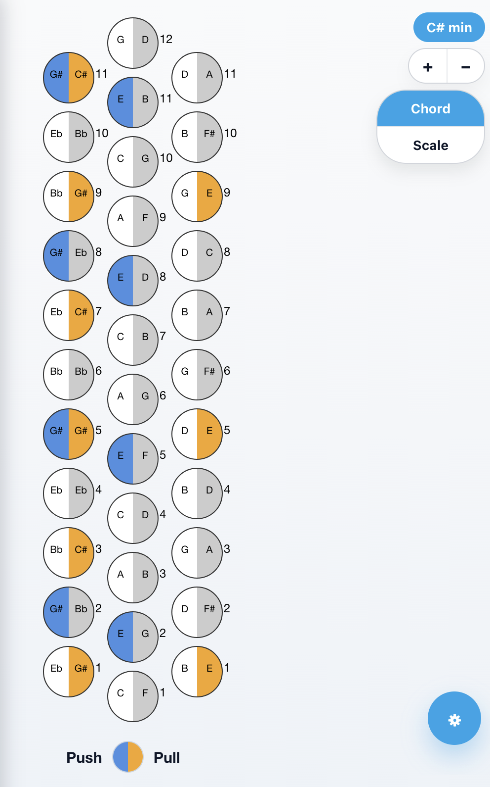

# Accordion Keyboard Visualizer

[](https://shogunweb.github.io/Accordion-keyboard-map/)
[](./docs/user/getting-started.md)

A web application for exploring the right-hand button layout of a diatonic or
unisonoric accordion. It runs entirely in the browser, without an account or backend.

- Display built-in or custom keyboard layouts and their push/pull notes.
- Highlight the notes of a **chord** or **scale** using Tonal.js.
- Create **2 or 3 row keyboards**, with **5–14 buttons per row** and vertical
  offsets from **−3 to +3 half-button units**.
- Save songs as sheets of distinct chords, each displayed on a complete keyboard.
- Download song sheets or a complete 12-page chord reference as vector PDFs.
- Back up and share custom keyboards and songs through separate JSON exports.
- Choose English/French UI and note notation independently, and install as a PWA.

<p align="center">
  
</p>

## Getting started

Open the [hosted application](https://shogunweb.github.io/Accordion-keyboard-map/)
or run it locally. The [user guide](docs/user/getting-started.md) covers the controls,
PDF downloads and backups. Local changes appear on the hosted site after deployment.

Use **Settings** to choose a keyboard and note notation. Chord/scale highlights
update automatically when the selection changes. Each button shows the push note
on its left half and the pull note on its right half; selected notes are blue
(push) or orange (pull).

### Small screens

On phones, the explorer fits the entire keyboard to the available screen height.
The **Menu** button opens navigation and Settings. Tap the current chord/scale to
choose its mode, root and type, then **Done** to return to the keyboard.

Use **+ / −** to enlarge the drawing and scroll within it; **Fit to screen**
restores the full view. **More actions (⋯)** contains Add to a song, the legend
switch and the chord reference PDF. The compact layout follows screen resizing
and also supports small phones in landscape.

In the keyboard editor, choose **Row 1 / 2 / 3** to edit one row at a time.
**Show preview** opens the complete layout, and the Save button stays at the
bottom of the screen. Switching rows preserves all entered notes.

### Custom keyboards

Open **My keyboards** to start with a blank layout or copy an existing model.
Set the number of rows, buttons and row offsets, then enter the push/pull notes.
English (`C`, `F#4`, `Bb3`) and French (`Do`, `Fa#4`, `Sib3`) input are accepted;
octave 0–8 is optional and unknown notes may be left blank. The preview updates
as you edit.

Choose **Save keyboard**, then **Use this keyboard**. Saved layouts are also
available in songs and PDFs. Editing a saved layout updates the songs using it;
built-in models can only be copied. Drafts survive switching views but need to be
saved before closing the application.

**Export this keyboard** exports the current draft; **Export all keyboards**
exports the saved custom library. **Import keyboards** previews the file before
confirmation. Imports preserve existing layouts and create copies on ID collisions.
Keyboard files are limited to 256 KiB. See the [keyboard file format](docs/dev/keyboard-files.md).

### Songs, PDFs and backups

In **My songs**, create a named song and add its distinct chords. Chords can be
edited, removed and reordered. Each song keeps its own keyboard selection.
**Download PDF** produces an A4 landscape sheet with complete keyboards and
adaptive pagination. In the explorer, **Download chord reference (PDF)** produces
12 pages with major, minor, dominant 7th and minor 7th chords for each chromatic root.

Songs and custom keyboards are saved in this browser's local storage. There is no
automatic synchronization across devices. Export JSON files to back up editable
data; PDFs are the printable output. Song exports contain keyboard IDs rather than
keyboard definitions, so import custom keyboards first when transferring to another
browser. Unavailable keyboard references require an explicit replacement during
song import. Song files are limited to 2 MiB; see the [song file format](docs/dev/song-files.md).

The PDF exporter loads on first use. A first PDF download while offline is not
guaranteed; reconnect and retry if necessary.

## Development

### Requirements and installation

Use npm and Node.js satisfying `^20.19.0 || >=22.12.0`, as required by the locked
Vite and React plugin versions. The devcontainer uses Node 24; CI selects Node 20.

```bash
npm ci
npm run dev
```

Open the URL Vite prints, normally
[http://localhost:5173/Accordion-keyboard-map/](http://localhost:5173/Accordion-keyboard-map/).
Keep the server running while testing. In a remote VS Code/devcontainer session,
forward the printed port through the **Ports** tab if necessary.

### Validation and production preview

```bash
npm run lint
npm run build
npm test -- --run
npm run preview
```

Build before running tests so the generated-version test can inspect the artifacts.
The custom build runs TypeScript and Vite, writes `dist/version.json`, and stamps
the service worker with the same version shown in Settings. Use `npm run build`
rather than invoking Vite directly. The preview command prints its own URL and
serves the generated `dist/`; rebuild after source changes to update it.

`npm run docs` generates the TypeDoc API documentation.

### Technologies

- **React 19 + TypeScript**, **Vite 7**.
- Plain **CSS** in global and component stylesheets. Tailwind CSS 4 is installed
  and configured through PostCSS, but the stylesheets do not import its directives.
- **Tonal.js** for music theory and pure **SVG** for keyboard rendering.
- **jsPDF + svg2pdf.js**, loaded on demand, for vector PDF downloads.
- **Vitest + Testing Library + jsdom**, and **ESLint**.
- A custom service worker and web manifest for PWA support.

### Project structure

```text
Accordion-keyboard-map/
├─ index.html                    # HTML entry point
├─ public/                       # Service worker, manifest, icons
├─ src/
│  ├─ main.tsx                   # React entry point
│  ├─ App.tsx                    # Views, preferences and shared libraries
│  ├─ App.css, styles.css        # Application/global styles
│  ├─ buildInfo.ts, serviceWorker.ts
│  ├─ components/
│  │  ├─ MobileKeyboard.tsx      # Fit-to-screen explorer and manual zoom
│  │  ├─ Drawer.tsx              # Modal panels and focus management
│  │  ├─ AccordionKeyboard.tsx   # SVG renderer
│  │  ├─ KeyboardEditor.tsx      # Custom layouts, preview and JSON exchange
│  │  ├─ Songbook.tsx            # Song library and chord sheets
│  │  └─ ChordReferenceButton.tsx
│  ├─ hooks/                    # Library persistence and compact-layout detection
│  ├─ data/
│  │  ├─ index.ts, types.ts      # Built-in loader and shared keyboard types
│  │  ├─ keyboards/             # One *.keyboard.ts file per built-in layout
│  │  ├─ customKeyboards.ts     # Custom validation and JSON exchange
│  │  └─ songs.ts               # Song data and storage validation
│  └─ utils/                    # Music helpers, song JSON and PDF export
├─ scripts/                     # Build orchestration and version stamping
├─ docs/                        # User and developer documentation
├─ .github/workflows/deploy.yml # CI and GitHub Pages deployment
├─ vite.config.ts
└─ package.json
```

Tests live alongside the source in `*.test.ts` and `*.test.tsx` files.
[LLM-context.txt](LLM-context.txt) contains the detailed source map, data conventions,
validation history and known documentation gaps.

### Keyboard data model

```ts
type KeyboardDefinition = { id: string; name: string; rows: KeyboardRow[] };
type KeyboardRow = { offsetY: number; buttons: ButtonLayout[] };
type ButtonLayout = { index: number; push: string; pull: string };
```

Rows are ordered **right to left** and buttons **bottom to top**, starting at
index 1. Offsets are in half-button units; positive values move a row upward.
Stored notes use ASCII letter names (`C4`, `F#`, `Bb3`) or an empty string. The
custom editor/importer normalizes French input and Unicode accidentals before
saving. Highlight matching uses pitch classes, so octave and enharmonic spelling
do not prevent matching; display labels retain musical spelling where possible.

### Adding a built-in keyboard

For a personal layout, use the editor. To include a model in the application:

1. Create `src/data/keyboards/my-layout.keyboard.ts`.
2. Import `KeyboardDefinition` from `../types` and default-export the layout,
   following an existing keyboard file.
3. Give it a unique, stable ID and a descriptive name. Use letter names and
   ASCII accidentals in the source data.
4. Run the checks and verify row order, offsets and push/pull notes in the browser.

`src/data/index.ts` loads these files automatically with `import.meta.glob` and
sorts them by name. There is no central keyboard list to edit. Avoid changing
existing IDs: saved preferences and songs refer to them.

## Deployment

The repository is configured for **GitHub Pages** at `/Accordion-keyboard-map/`.
The CI workflow installs dependencies, builds and runs tests. Successful non-PR
runs on `main` publish `dist/` to Pages. Lint is currently a local check.

For another static host such as OVH:

1. Set `base` in `vite.config.ts` to the deployment path (`/` for the domain root,
   or a subfolder such as `/accordion/`).
2. Update `start_url` and `scope` in `public/manifest.webmanifest` to the same path.
3. Run `npm run build`, then upload the **contents** of `dist/` to that location.
4. Verify the production URL, PWA update behavior and offline loading after caching.

The service worker is registered in production/preview, not in the development
server. A waiting update is offered in the app; the build number appears in Settings.

## 📄 License

Copyright (2025) Jérémie Fays. This project is released under the **AGPLv3+ license**.
If you modify or build an application based on this code and distribute it — including by offering it as a web service — you must comply with all terms of the AGPLv3+ license.
In particular, you are required to provide your users with access to the corresponding source code.


## Contribute

Whether you’re a user or a developer, contributions are welcome!

* **For non-developers** (ideas, bug reports, keyboard layouts, documentation feedback):
  👉 See the [`User Contribution Ideas`](./docs/user/getting-started.md#contribution-ideas-no-coding-required) 


* **For developers** (code, features, fixes, workflow improvements):
  👉 See the [`Developer Contribution Guide`](./docs/dev/contributing.md):
